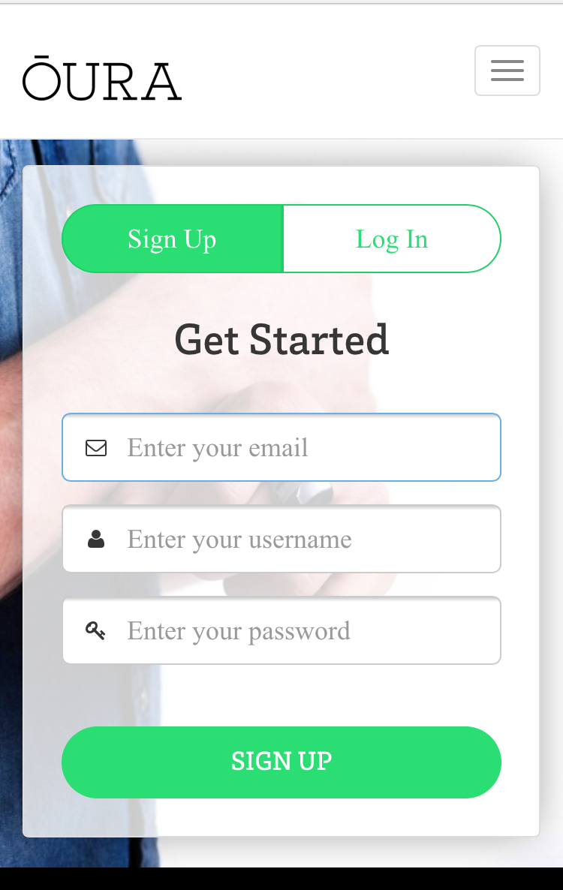
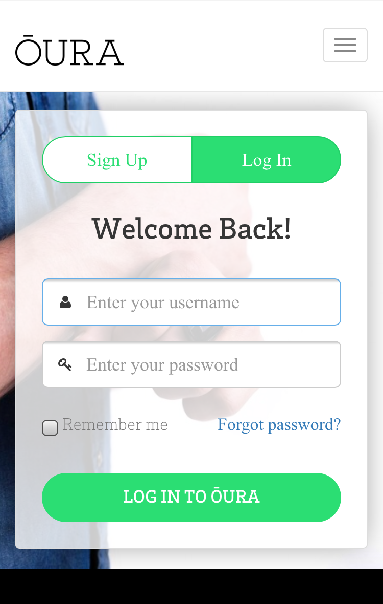
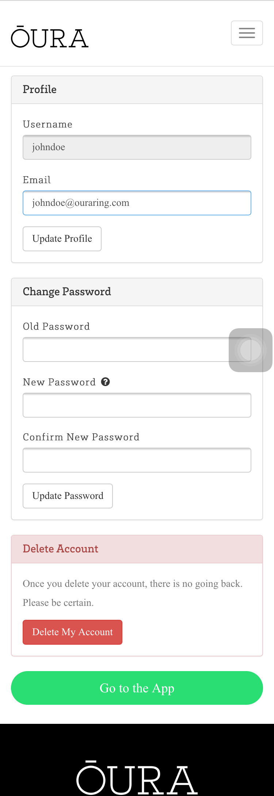

# User Flow

## Home Page

Go to the home page

## Signup Or Login

Create account or login

## My Account Page

After signup or login, user will be redirected to the my-account page.

At the bottom of the page there will be a button **Go to the App** which will redirect the user to the Oura mobile app.

That button is basically an HTML anchor tag with `href` set to a custom URL like 
`ouraapp://?token=2ff3e17b-8a93-46ad-af75-67bc7aecd7a1`. This custom URL need to be implemented based on the name 
of the Oura mobile app. The custom URL basically consist of the mobile app's name suffixed by `://`.

This custom URL is also passing a token parameter to the Oura mobile app which can be used to authenticate the user 
while hitting the resource endpoints for pushing the activity data to the server.

For more description on registering custom URL for the app, please follow [this article](http://iosdevelopertips
.com/cocoa/launching-your-own-application-via-a-custom-url-scheme.html)